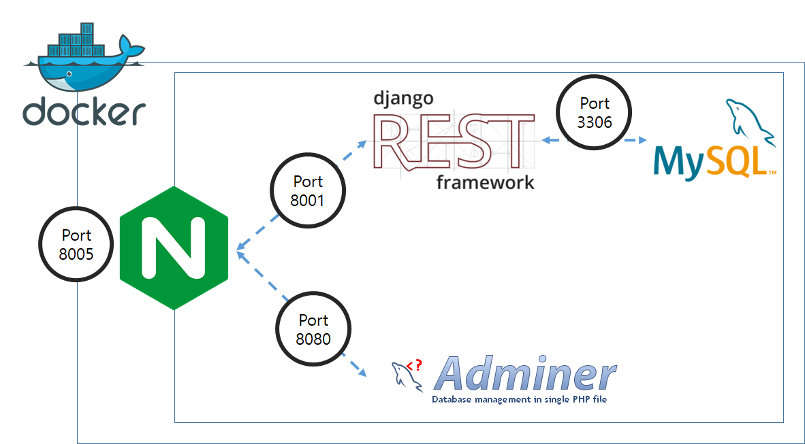

# docker-compose 를 통한 환경 구축

>Docker version 19.03.13, build 4484c46d9d
>
>docker-compose version 1.27.4, build 40524192

## docker-compose 명령어


1. Backend, DB, Nginx, adminer 실행

    ```bash
    cd Django
    touch secrets.json
    # { "SECRET_KEY": "시크릿 키" }
    mkdir mysql  # data 저장을 위한 폴더
    touch .env  # DB 구축을 위한 env파일
    # DB_ROOT_PASSWORD=
    # DB_DATABASE=
    # DB_USER=
    # DB_PASSWORD=
    
    docker-compose up
    ```

2. URL

    ```bash
    db 관리, adminer
    	localhost:8005/db/
    backend, API
    	localhost:8005/	
    ```

3. Container

    1. backend1
    2. db
    3. adminer
    4. nginx

4. Backend 구조 및 port

    1. AWS에서 port를 통해 Nginx에 연결
    2. Nginx 내부에서 expose를 통해 container를 연결

